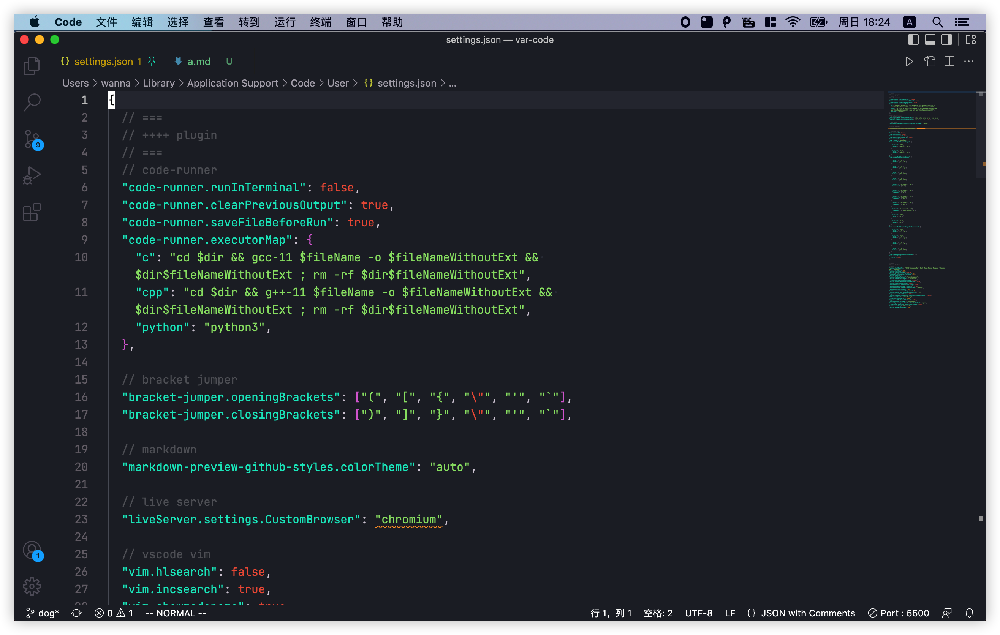

# Heading Level

Paragraph
---------

I really like using markdown.

I think I'll use it to format all of my document from now on.

## Line Break

First line with two spaces after.
And the next line

First line with the HTML tag after.<br>
And the next line

## Bold and Italic

I just love **bold** text.<br>
I just love __bold__ text.

Italicized text is the *cat's meow*.<br>
Italicized text is the _cat's meow_.

This text is realy ***very*** important text.<br>
This text is realy ___very___ important text.

## Blockquote

> I love markdown.
>
> Paragraph and Line break are different.
>> Nested Blockquotes

> #### Head 4
>
> - apple
> - peach
>
> **Everything** is OK.

## List

1. First item
2. Second item
9. Third item
2. End

\* \+ \- are OK
- Fir
  - aa
  - bb
- Sec
  1. cc
  2. dd
- Thi

Add Elements in Lists.<br>
Indent the element **4** spaces
1. This is the first list item.

    Add a paragraph

2. Here's the second list item.
    Add two blocks after this level. This will not be so far.
3. And here's the third list item.

    > As a paragraph

4. Fourth item.

## Code

At the command prompt, type `nano`.

      <html>
        <head>
          HEAD
        </head>
      </html>

To create code blocks, indent every line of the block by at least four spaces or one tab.<br>
To create code blocks without indenting lines, use **fenced code blocks**.

## Horizontal Rules

To create a horizontal rule, use three or more asterisks (\*\*\*), dashes (\-\-\-), or underscores (\_\_\_) on a line by themselves.

---------

after a horizontal rule.

## Links

My most hated search engine is [Baidu](https://baidu.com).

My favorite search engine is [Google](https://google.com "This is a title").

Baidu: <https://baidu.com><br>
163mail: <wannademail@163.com>

I love supporting the **[EFF](https://eff.org)**.<br>
This is the **[Markdown Guide](https://www.markdownguide.org)**.<br>
See the section on [`code`](#code).

Link [one][1]<br>
Link [two][2]

The second part os reference-style link is formatted with the following attributes:

1. The label, in brackets, followed immediately by a colon and at least one space (e.g., [label]: ).
2. The URL for the link, which you can optionally enclose in angle brackets.
3. The optional title for the link, which you can enclose in double quotes, single quotes, or parentheses.

[1]: https://www.baidu.com "title"
[2]: https://www.cn.bing.com (title)

## Images


## Escaping Characters

\* Without the backslash, this would be a bullet in an unordered list.

&amp; and &lt;<br>
& and >

## HTML

This **word** is bold, and this <em>word</em> is italic.



## Tables

| Syntax | Description|
| - | - |
| Header | Title |
| Paragraph | Text |

---

| Title | Description | Sytax |
| :---    | :--:      | --:      |
| a | A | AA |
| aaaa | AAAAAAA | AAaaaaa|

---

| A | B |
| - | - |
| &#97; | &#124; |


## Fenced Code Blocks

``` json
{
  "firstName": "John",
  "lastName": "Smith",
  "age": 25
}
```

~~~python
import random

print(random.randint(0, 101))
~~~

## Footnotes

Here's a simple footnote[^1], and here is a longer one[^longnote].

[^1]: First note
[^longnote]: Long note

## Heading IDs

Link to [Line Break](#line-break)

## Definition Lists

First Term
: This is the definition of the first term.

Second Term
: This is one definition of the second term.
: This is another definition of the second term.

## Strikethrough

~~The world is flat~~. We now know that the world is round.

## Task Lists

- [x] Write the press release
- [ ] Update the website
- [ ] Contact the media

## Using Emoji Shortcodes

Gone camping! :tent: Be back soon.<br>
That is so funny! :joy:.<br>
Simply copy and paste.  🔥

## Highlight

I need to highlight this: <mark>word</mark>

